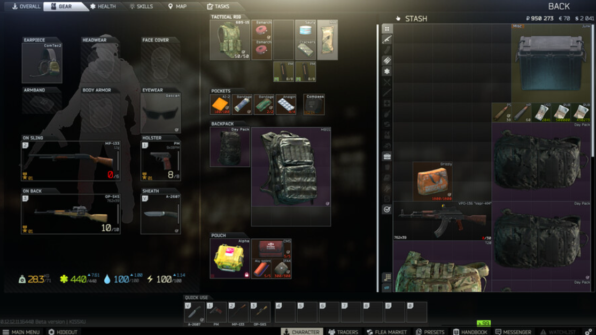

# KGCA42기 A팀 Unreal Project

## 목차
- [KGCA42기 A팀 Unreal Project](#kgca42기-a팀-unreal-project)
  - [목차](#목차)
  - [개요](#개요)
  - [역할 분담](#역할-분담)
  - [게임 설명](#게임-설명)
  - [프로젝트 구조](#프로젝트-구조)
  - [지금까지 한 일](#지금까지-한-일)
    - [유원석](#유원석)
    - [김선우](#김선우)
    - [채해병](#채해병)
    - [박성철](#박성철)
  - [To Do List](#to-do-list)
    - [김선우](#김선우-1)
    - [박성철](#박성철-1)
    - [채해병](#채해병-1)
    - [유원석](#유원석-1)

## 개요
- 프로젝트 명: **Unreal_Team_Portfolio**
- 프로젝트 기간: 2024.0 ~ 2024.0
- 프로젝트 인원: 박성철, 채해병, 김선우, 유원석
- 프로젝트 목표: Game Ability System을 적용한 TPS 게임 개발

## 역할 분담
- 박성철: UI
- 채해병: AI,맵
- 김선우: Weapon, Item
- 유원석: 캐릭터

## 게임 설명

* Extraction Shooter장르의 게임으로 건물에 진입해 적들을 제거하고 아이템을 획득해 탈출하는 게임

* AI 적들을 구현하고 추후 멀티 플레이 기능을 추가할 예정 



배틀 그라운드의 UI와 타르코프의 UI를 합친 스타일의 UI를 구현 장비 변경시  
플레이어의 외형이 변경되며 아이템은 사이즈를 가지며 인벤토리내에서 플레이어가 원하는 위치에 배치할 수 있음
</br></br></br></br>


## 프로젝트 구조
```bash

```


## 지금까지 한 일

### 유원석
* 캐릭터
* 캐릭터 어빌리티 시스템
  * 달리기
  * 슬라이딩
  * 클라이밍
  * 점프
  * 시점 변환
  * 앉기
* 캐릭터 애니메이션
  * locomotion

### 김선우
* 총
* 아이템 줍기
* 발사체
### 채해병
* AI 구현
  * 정찰
  * 체력 적어지면 숨기
  * 추격
* 맵 구현 
  * 상호작용 가능한 오브젝트
  * 맵 디자인
  

### 박성철
* 인벤토리 UI
  *  인벤토리 그리드 구현
  *  아이템 크기에 따른 배치
  *  아이템 회전  
## To Do List

### 김선우
  - 탄약 인벤토리 구현
  - 아이템 구급상자, 수류탄 
  - 재장전 로직
  - 총알 0이면 발사 막기 
  - 장비 UI 구현
  - 장비 변경시 캐릭터 외형 변경
  - 장비 데미지 모듈
  
### 박성철
  - UI 작업
  - 
### 채해병
  - AI 공격
  - 개인 추가

### 유원석
  - 캐릭터 사망 처리 
  - 슬라이딩 버그 수정
  - 어빌리티 C++로 변경
  - 애니메이션 aimoffset 관련 버그 수정(팔 붙는거)
  - 부위별 데미지, 부위별 피직스 애니메이션

  - 재장전


