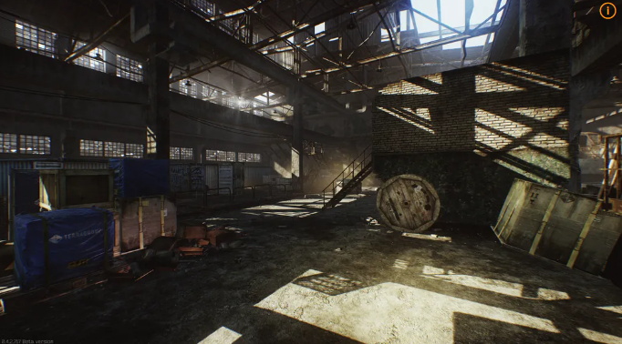

# KGCA42기 A팀 Unreal Project

## 목차
- [KGCA42기 A팀 Unreal Project](#kgca42기-a팀-unreal-project)
  - [목차](#목차)
  - [개요](#개요)
  - [게임 설명](#게임-설명)
  - [프로젝트 구조](#프로젝트-구조)
  - [역할 분담](#역할-분담)

## 개요
- 프로젝트 명: **Unreal_Team_Portfolio**
- 프로젝트 기간: 2024.0 ~ 2024.0
- 프로젝트 인원: 박성철, 채해병, 김선우, 유원석
- 프로젝트 목표: Lyra Sample Project를 기반으로하여 Game Ability System을 적용한 FPS 게임 개발

## 게임 설명

* Extraction Shooter장르의 게임으로 건물에 진입해 적들을 제거하고 아이템을 획득해 탈출하는 게임
* AI 적들을 구현하고 추후 멀티 플레이 기능을 추가할 예정 


위 사진에 UI에서 플레이어의 장비 변경 시 캐릭터의 모습이 변경되는 기능을 추가할 예정  
인벤토리는 바이오 하자드의 인벤토리를 참고하여 구현할 예정


맵은 1개의 건물로 구성되며 간단히 구현할 예정

건물 내부에서 ai와 전투를 하며 목표를 달성하면 탈출


## 프로젝트 구조
```bash

```

## 역할 분담
- 박성철: UI
- 채해병: AI
- 김선우: Weapon, Item
- 유원석: 캐릭터